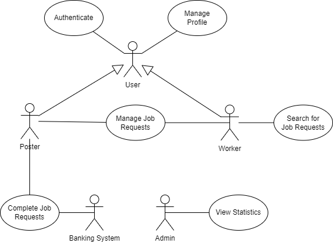
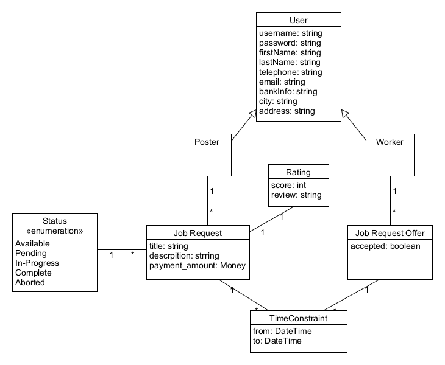
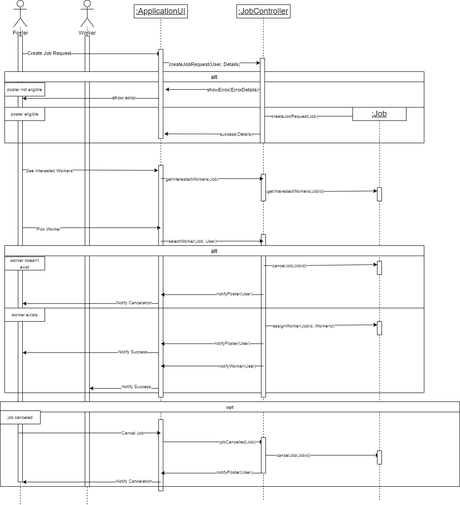

# Introduction 

## Brief Description

An application that will allow users to declare a need for various services (such as household chores, going to the supermarket, driving children to / from school) and other users to apply to fulfill them.

Each user of the application has a profile where their personal information, ratings from other users and job requests are stored and displayed.

For the request of services the user declares the deadline (when they want the job to be completed) and the job's location and compensation. Once someone is interested in this service, the user will receive a notification regarding one of their declared services as well as the specific date and time when the request will be fulfilled (which will definitely be within the declared limits). At the end of the work the user will receive his evaluation from the user that requested the service and their compensation will be credited to their account.

To search for services, the user searches with specific search terms (for example: type of job, date, time, place, range of compensation) and all the requests for services that satisfy those conditions are shown. Once the user expresses an interest in fulfilling a request, they specify the date and time that they would like to complete the work and confirm the request for the service. 

The application will export statistics such as volume of payments per month, monthly service revenue from commissions to users' payments (there will be a commission rate for each payment), etc.

## Functional Requirements 
### Registration - Authentication 
1.  The user provides their personal details. These include their first and last name, address, bank information, email and mobile number. They then provide a unique username and a password, concluding their registration.
2.  The registered user submits their username and password to be authenticated before gaining access to the application.

### Posting Job Requests - Poster 
1.  The Poster fills the necessary fields to create a job request. These include: a short title, description, time constraints and the amount of compensation for the job. The job request can be canceled at any time by the Poster.
2.  When the status of a job request changes from "available" to "pending" the Poster is notified with the information of the Worker that expressed an interest in said request, along with the date and time specified by the Worker.
3.  The Poster may confirm the "pending" job request, in which case the Worker is notified, and the job is marked as "in-progress".
4.  The Poster may also decline the "pending" job request, in which case the Worker is notified, and the job is marked as "available" if no one else has expressed their interest in that job. Otherwise, it remains marked as "pending".
5.  When the date and time indicated by the Worker's availability expires in an "in-progress" job request the Poster is requested to evaluate the job, whether it was completed successfully or not. The request is then marked as "complete".
6.  When a job request is marked as "complete", the Poster is requested to rate the Worker.

### Accepting Job Requests - Worker 
1.  The Worker may search for a job request using various criteria. These include: type of job, date and time, location, cost, rating, etc.
2.  All job requests with the "available" or "pending" status that don't conflict with the above criteria are shown.
3.  In order to choose a job request, a specific date and time is also provided indicating the Worker's availability.
4.  After accepting a job request, it is marked as “pending” and the Worker along with their availability is associated with that request.

### User Profiles 
1.  The publicly available user profile is visible by Workers when viewing job requests and by Posters when viewing the Workers who have accepted one of their job requests.
2.  Only the appropriate details are shown when viewing a profile, a Poster may only see the Worker-related information of another user when viewing one of their pending offers.
3.  The Poster profile additionally includes: a list of previously requested jobs and their statuses.
4.  The Worker profile additionally includes: a list of previously accepted jobs and their statuses.
5.  Users may edit their profile details at any time.

### Statistics 
1. A system administrator, once authenticated, can access and view various statistics such as the monthly volume of transactions which took place via the application, monthly revenue etc.

## Definitions of key terms: 
| Key Term | Definition |
| --- | ----------- |
| Poster | The user that posted a job request. |
| Worker | The user selected by the Poster to fulfill the job request. |
| Available | A posted job request for which no one has expressed interest. Anyone is allowed to do so. |
| Pending | An available or pending job request where at least one person has expressed their interest in fulfilling. Anyone can still express their interest for it until the Poster selects one of them. |
| In-Progress | A pending job request where the Poster has selected a Worker to fulfill it. |
| Complete | An In-Progress job request which was completed successfully, as per the evaluation of the Poster. |

## Overview 
This document is compatible with the ISO/IEC/IEEE 29148:2018 "Systems and software engineering--Requirements for managers of information for users of systems, software, and services" standard.

1. [Introduction](#introduction)
    1. [Brief Description](#description)
    2. [Functional Requirements](#requirements)
        1. [Registration - Authentication](#registration)
        2. [Posting Job Requests](#posting)
        3. [Accepting Job Requests - Worker](#accepting)
        4. [User Profiles](#profiles)
        5. [Statistics](#statistics)
    3. [Definitions of key terms](#definitions)
    4. [Overview](#overview)
2. [Complete Description](#complete description)
    1. [Use Case Diagram](#use case diagram)
    2. [Assumptions And Dependencies](#assumptions)
    3. [Use Cases](#use cases) 
3. [Special Requirements](#special requirements)
    1. [Use Cases](#use cases)
        1. [Stakeholders](#stakeholders)
        2. [Actors](#actors)
        3. [Use Case Descriptions](#use case descriptions)
    2. [Additional Specifications](#specifications)
        1. [Interface requirements](#interface)
        2. [Design and Implementation Constraints](#constraints)
        3. [Quality Characteristics](#quality)
4. [Supporting Material](#materials)
    1. [Analysis Classes](#analysis classes)
    2. [Behaviors](#behaviors)
        1. [Manage Job Request](#manage behavior)
    3. [Business Rules](#rules)

# Complete Description 

## Use Case Diagram 

## Assumptions 

-   The users respond in a timely manner to each request.
    
-   The users rate each other honestly
    
-   The poster only marks a request as ‘completed’ once it’s actually completed.
    
-   The poster only marks a request as ‘aborted’ only if the worker doesn’t fulfill it.

# Special Requirements 

## Use Cases 

### Stakeholders 

| Stakeholder | Needs |
| --- | ----------- |
| User | - Maintain a public profile   - Be properly informed about the details and history of other users   - Navigate the system in the simplest way possible   - See common needs of ‘Poster’ and ‘Worker’ |
| Poster | -   The job request should be seen by as many candidate workers as possible   - The job request should be seen by the most suitable candidate workers   - Be informed about the candidate workers and be able to choose the most suitable for fulfilling a given job request   -   Job requests’ deadlines should be flexible |
| Worker | -   Be presented with as many job requests as possible   -   Be presented with job requests only relevant to him   -   Deadlines, payment amount and important details must remain constant when presented with job requests   -   Be informed of changes in the status of a job request he has expressed interest in |
| Administrator | -   Be presented with statistics about overall payments, system traffic, revenue etc |

### Actors 

| Actor  | Description | Goals | Stakeholders |
| --- | ----------- | ---- | ---- |
| User | Any registered user  of the application | -   Manage Profile   -   Access other profiles | |
| Poster | A user that posted a   job offering. | -   Manage job request   -   Complete job request   -   Post job request | Worker |
| Worker | A user willing to fulfill   the job offering. | -   Search for job requests   -   Complete job request | Poster |
| Banking System | Any banking system   that facilitates real life   transactions. | -   Handle payment | Poster,  Worker,  Administrator
| Administrator| A user with special   privileges that is   associated with the  application’s   management team. | -   View statistics | |

### Use Case Descriptions 

#### [UC1: Manage Job Request](uc1-Manage_Job_Request.md)

  

#### [UC2: Complete Job Request](uc2-Complete_Job_Request.md)

  

#### [UC3: Authenticate User](uc3-Authenticate_User.md)

  

#### [UC4: Manage Profile](uc4-Manage_Profile.md)

  

#### [UC5: View Statistics](uc5-View_Statistics.md)

  

#### [UC6: Search For Job Requests](uc6-Search_For_Job_Requests.md)

## Additional specifications 

### Interface requirements 

#### User Interfaces

-   The User Interface should satisfy all of Nielsen’s principles

#### Hardware Interfaces

- None

#### Communications Interfaces

-   The System will use android notifications to send messages to the user.

#### Software Interfaces

-   The System will communicate with the Banking System via a special class interface.

### Design and Implementation Constraints 
-   The System must be compatible with SQL Server.
    
-   The System will be programmed using the Java programming language with the Android APK for the application user interface.
    
-   The System must be supported by Java Virtual Machines using version 8 or higher.

### Quality Characteristics 

#### Performance
-   The System must remain responsive to the user while retrieving and processing data.
    
-   The Database must respond within a maximum timespan of 4 seconds.

#### Availability
- The Database should remain functional during all workdays, and be able to recover from software errors.

#### Security

-   The password needs to be encrypted before being sent to the System.
    
-   The users must be authenticated before gaining access to the System.
    
-   The information exchanged between the System and the users must be properly encrypted.

#### Agility

-   Each change to the System’s logic must not influence more than 5 classes

#### Ease of Use

-   The user must know how to navigate the application with rudimentary experience with android applications

# Supporting Material 

## Analysis Classes 

## Behaviors 

### Manage Job Request 

## Business Rules 
| BR | Description |
| --- | ----------- |
| BR1 | The Job Requests relevant to the Worker are the ones closer to his location. |
| BR2 | The Workers relevant to the Poster are the ones closer to his location, and with the best reviews. |
| BR3 | The deadline of a Job Request can only be modified once by the Poster. |

