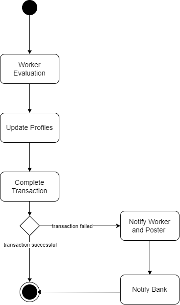

# UC2: Complete job request

**Primary actor:** Poster

**Secondary actor:** Banking System

**Stakeholders:**

-   Poster: Wants to complete the request in the fastest and easiest way possible.
    
-   Worker: Depends on the successful transaction for monetary compensation.
    
-   Administrator: Depends on the successful transaction for revenue purposes.
    

**Requirements:**

-   Both parties have been authenticated by the System
    
-   The job request hasn’t been canceled
    

  

## Basic flow:

1.  The poster notifies the System that the job is completed.
    
2.  The poster is asked to rate the worker. The rating is mandatory.
    
3.  The System updates the profiles of both parties.
    
4.  The transaction between the poster and the worker is handled by the Banking System
    

  

## Alternative flows:

1. The transaction is unable to be fulfilled.

2.  The users are notified
    
3.  The Banking System is notified

## Activity Diagram

